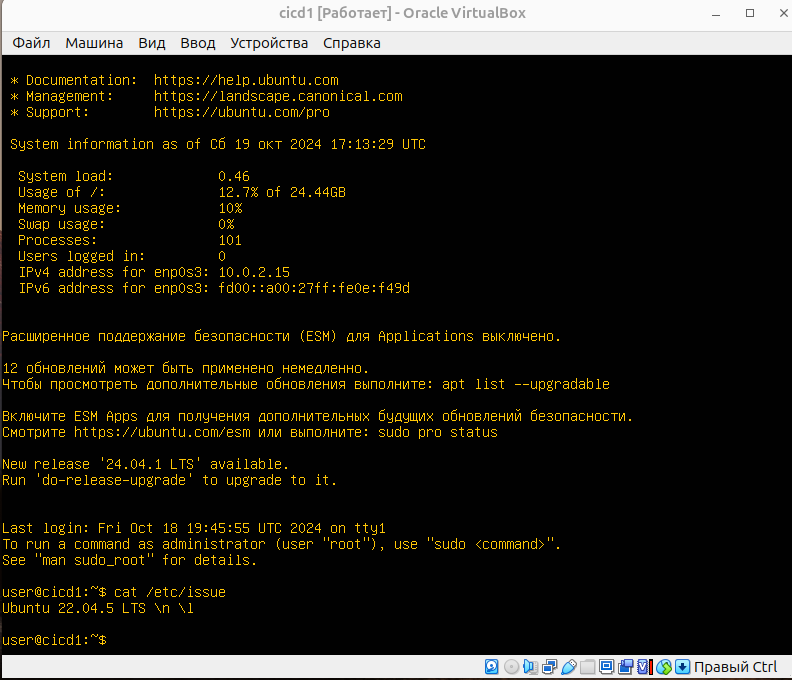
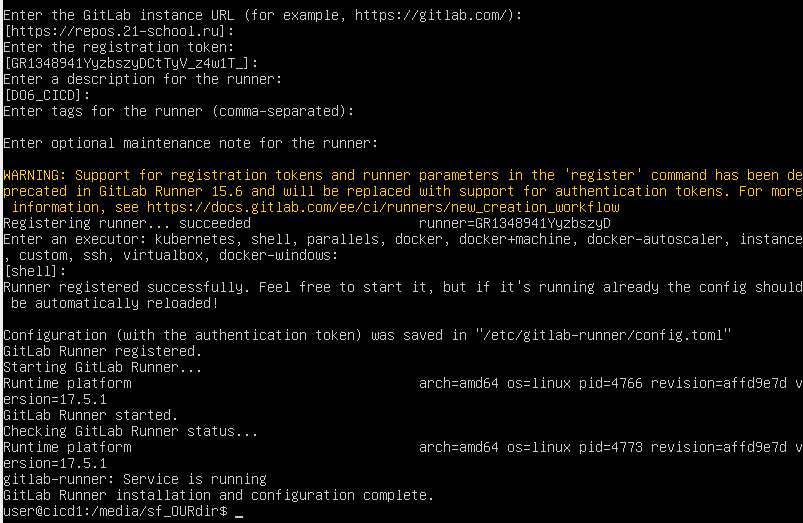

# Part 1. GitLab Runner Setup

> Russian version: [Part1_ru.md](../ru/Part1_ru.md)

## 1.1. Preparing the Virtual Machine

Create a virtual machine running `Ubuntu Server 22.04 LTS`.



---

## 1.2. Installing GitLab Runner

> GitLab Runner installation script: [src/scripts/install_gitlabrunner.sh](../../src/scripts/install_gitlabrunner.sh)

The script performs the following actions:

* adds the official GitLab Runner repository;
* installs the `gitlab-runner` package;
* starts the runner registration process;
* starts the GitLab Runner service;
* checks its status.

Run the script:

```bash
sudo chmod +x install_gitlabrunner.sh
sudo bash install_gitlabrunner.sh
```

---

## 1.3. Registering GitLab Runner

After installation, register GitLab Runner for use with the project.

During registration, provide:

* the GitLab instance URL;
* the project registration token;
* a runner description;
* the executor type.

Use the following description:

```text
DO6_CICD
```

Select the following executor:

```text
shell
```

The registration process is shown below.



---

## Summary

GitLab Runner was installed and started on the virtual machine, then registered for the DO6_CICD project using the shell executor.

---
