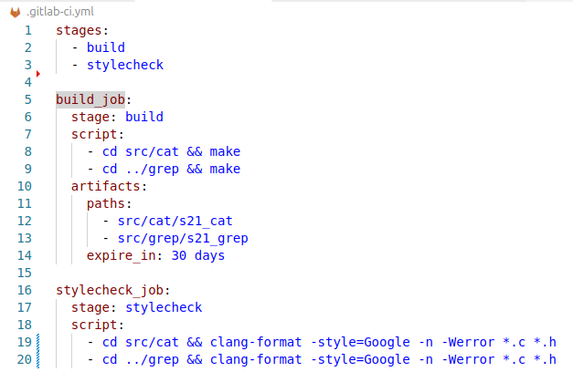
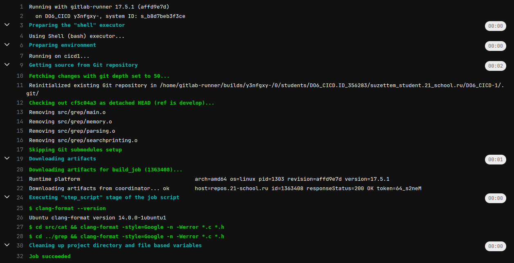
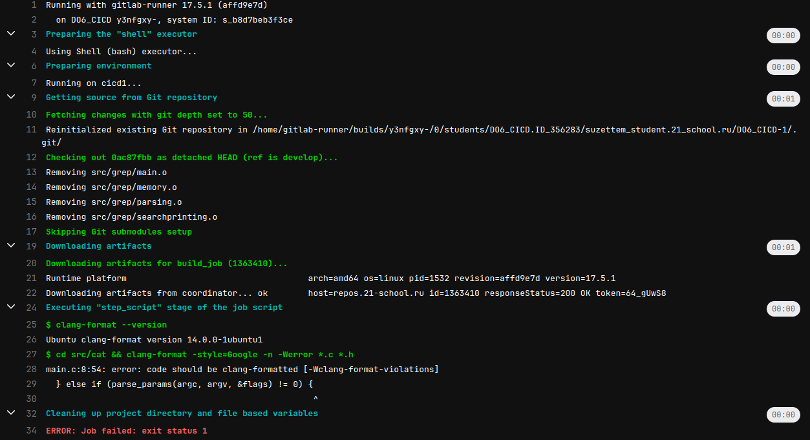

# Part 3. Code Style Check

> Russian version: [Part3_ru.md](../ru/Part3_ru.md)

## 3.1. Configuring the Code Style Check

To run the code style check, install `clang-format` on the virtual machine:

```bash
sudo apt install clang-format
```

Add a code style check stage to the `.gitlab-ci.yml` file.

At this stage, the source code of the `s21_cat` and `s21_grep` projects is checked for compliance with the Google C Style guidelines.

Formatting is performed using a `.clang-format` configuration based on the Google style.

`.gitlab-ci.yml`:



> `.gitlab-ci.yml` used in this part: [/src/history/Part3/.gitlab-ci.yml](../../src/gitlab-ci.yml/history/Part3/.gitlab-ci.yml)

> `.clang-format` configuration: [/src/.clang-format](../../src/.clang-format)

---

## 3.2. Pipeline Verification

After committing the changes, GitLab automatically starts the style check stage.

Successful style check:




Example of a formatting error causing the pipeline to fail:



---

## Summary

A code style check stage using `clang-format` was added to the pipeline. If formatting violations are detected, the pipeline terminates with an error.

---

## Navigation

↑ [README](../../README.md)

← [Part 2. Build](Part2.md)

→ [Part 4. Tests](Part4.md)

---