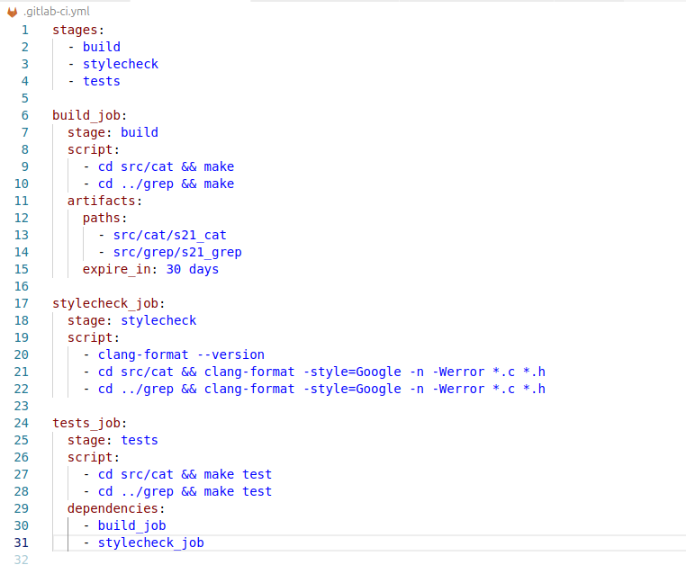
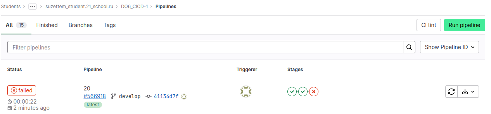
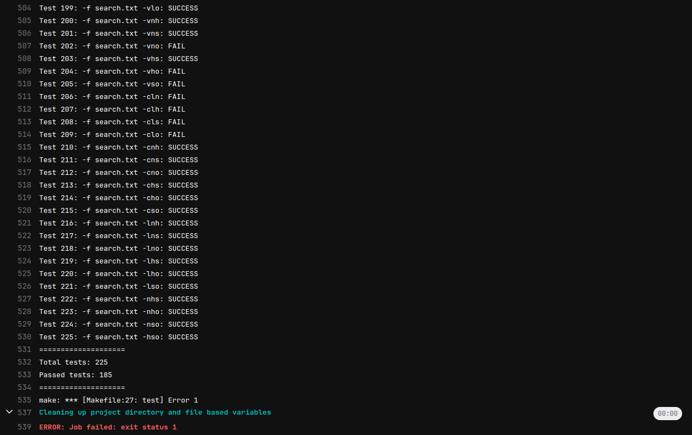
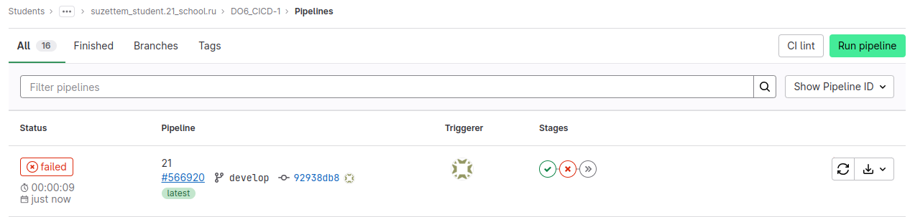
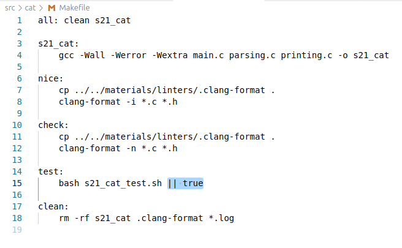
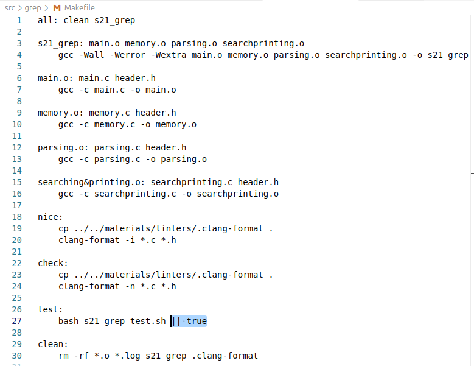
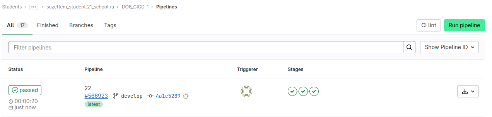
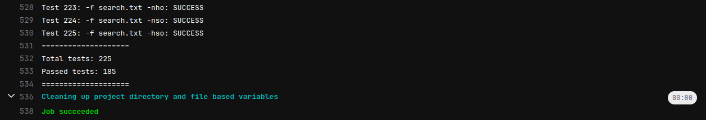

# Part 4. Tests

> Russian version: [Part4_ru.md](../ru/Part4_ru.md)

## 4.1. Configuring the Testing Stage

Add an integration testing stage to the CI pipeline for the `s21_cat` and `s21_grep` projects.

This stage runs only after the build and code style check stages have completed successfully.

`.gitlab-ci.yml`:

> `.gitlab-ci.yml` used in this part: [/src/history/Part4/.gitlab-ci.yml](../../src/gitlab-ci.yml/history/Part4/.gitlab-ci.yml)

---

## 4.2. Pipeline Execution Results

If any test fails, the stage finishes with an error:

If one of the previous stages fails, the testing stage is not started due to the configured pipeline stage order:

---

## 4.3. Configuring the Test Environment

To ensure correct test execution in the CI environment, the Makefiles of the `s21_cat` and `s21_grep` projects were adapted accordingly.

> Project Makefiles: [/src/makefiles/](../../src/makefiles/)

Successful execution of all pipeline stages:

---

## Summary

A testing stage dependent on the build and code style check stages was added to the CI pipeline.

---

## Navigation

↑ [README](../../README.md)

← [Part 3. Code Style Check](Part3.md)

→ [Part 5. Deployment Stage](Part5.md)

---