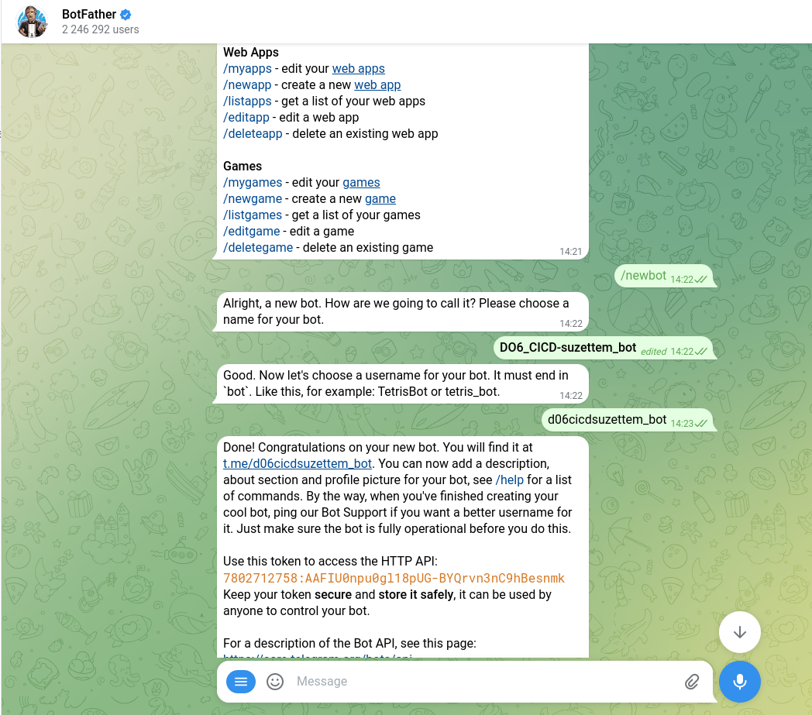
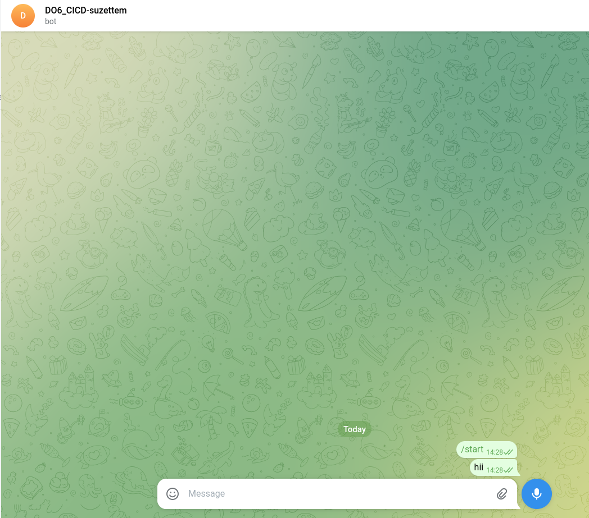
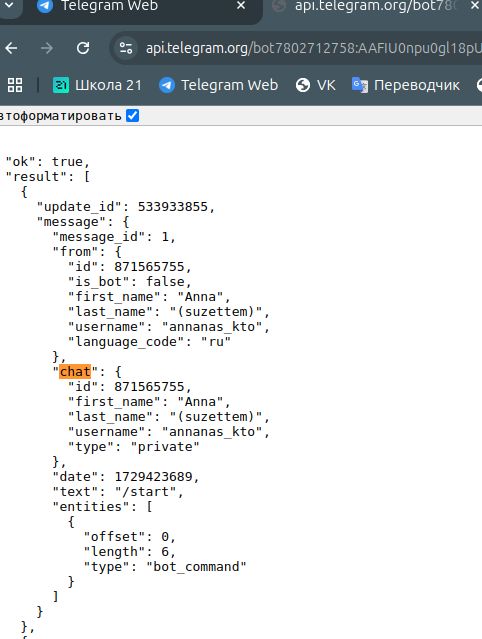
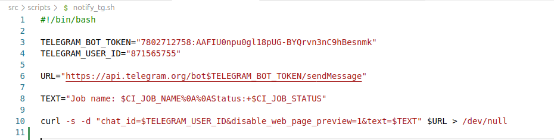
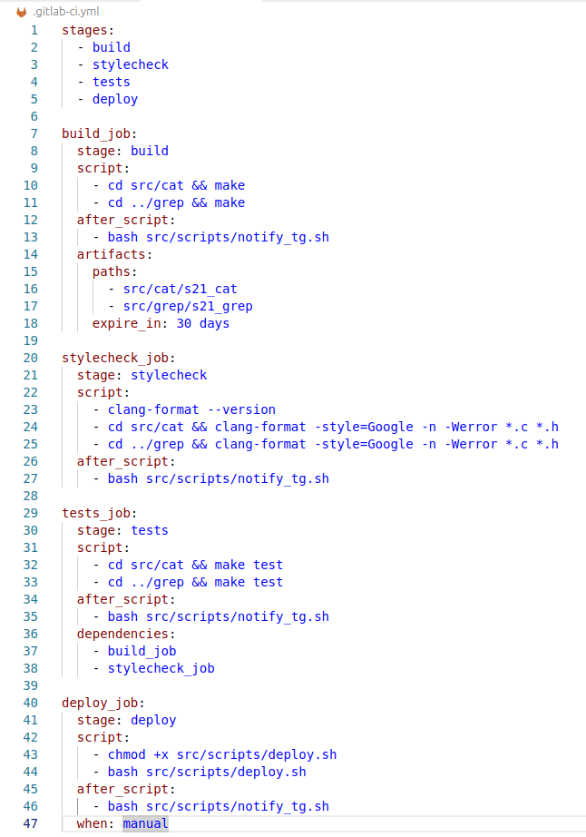
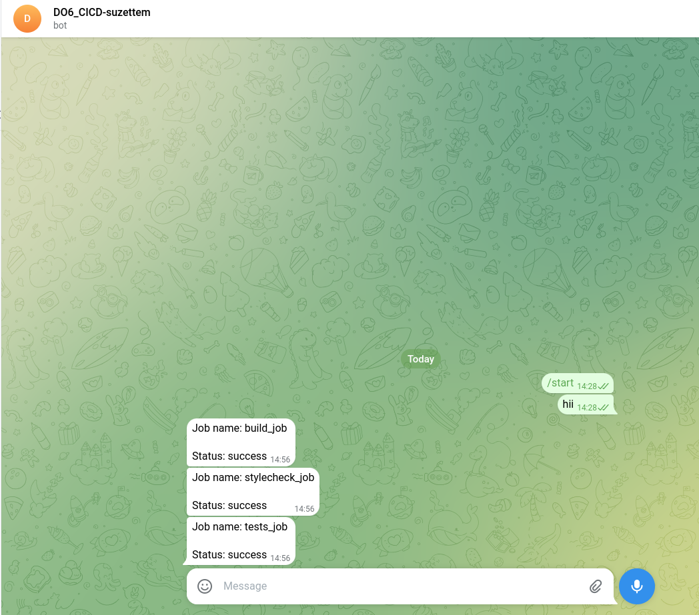

# Part 6. Telegram Notifications

> Russian version: [Part6_ru.md](../ru/Part6_ru.md)

## 6.1. Creating a Telegram Bot

Create a bot using the Telegram bot `BotFather`.

Send the following command:

```text
/newbot
```

Then specify a display name and a unique username for the bot.

`BotFather` will return a token that will be used for sending notifications.



---

## 6.2. Obtaining the Chat ID

Find the created bot in Telegram and send it any message.



Then open the following page:

```text
https://api.telegram.org/bot<TOKEN>/getUpdates
```

where `<TOKEN>` is the token received during bot creation.

In the response, find the `chat.id` value, which will be required for sending notifications.



---

## 6.3. Creating the Notification Script

Create the script:

```text
src/scripts/notify_tg.sh
```

The script generates a message using GitLab CI environment variables and sends it through the Telegram Bot API.



> Script file: [/src/scripts/notify_tg.sh](../../src/scripts/notify_tg.sh)

---

## 6.4. Adding Notifications to the Pipeline

Configure the script to run after each pipeline stage using the `after_script` section.

`.gitlab-ci.yml`:



> `.gitlab-ci.yml` used in this part: [/src/history/Part6/.gitlab-ci.yml](../../src/gitlab-ci.yml/final/.gitlab-ci.yml)

---

## 6.5. Verifying Notifications

After starting the pipeline, the bot begins receiving notifications about the execution status of CI/CD stages.



---

## Summary

Telegram notifications were configured for GitLab CI/CD to report the execution status of pipeline stages.

---
