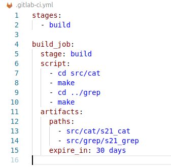
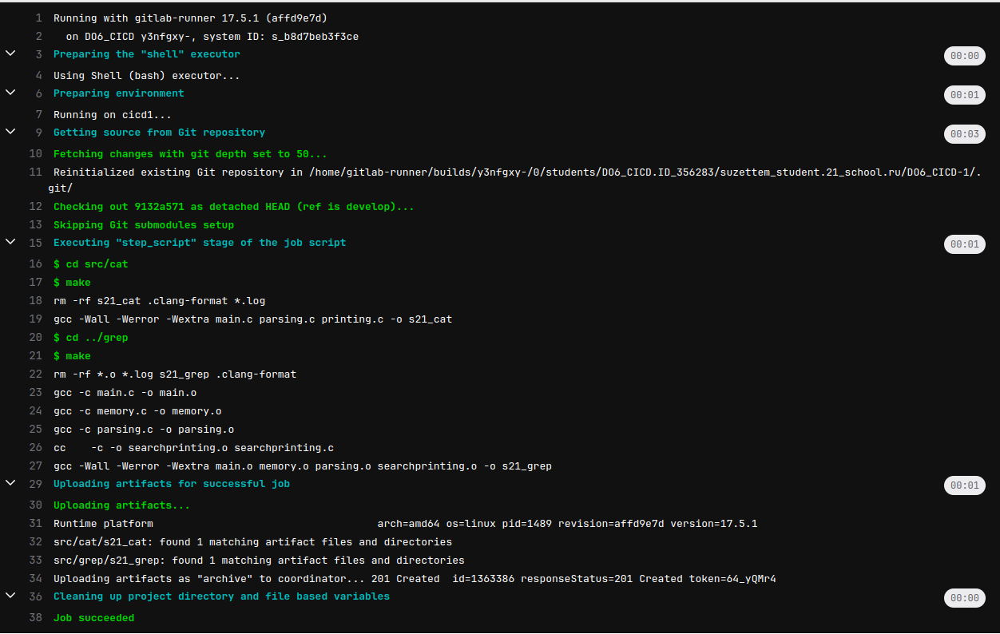

## Part 2. Сборка

> English version: [Part2.md](../eng/Part2.md)

## 2.1. Подготовка окружения

Для работы с репозиториями был настроен SSH-доступ.

Сгенерируем SSH-ключ:

```bash
ssh-keygen
```

Установим права доступа:

```bash
chmod 700 ~/.ssh
chmod 600 ~/.ssh/id_rsa
chmod 644 ~/.ssh/id_rsa.pub
```

Настроим данные пользователя Git:

```bash
git config --global user.name "<nickname>"
git config --global user.email "<email>"
```

После этого были клонированы репозитории проекта CI/CD и тестового приложения.

---

## 2.2. Настройка этапа сборки

Создадим файл:

```text
src/.gitlab-ci.yml
```

На данном этапе пайплайн состоит из одного этапа — сборки.

Файл `.gitlab-ci.yml`:
 


В задаче выполняется:

* сборка приложения `s21_cat`;
* сборка приложения `s21_grep`;
* сохранение полученных исполняемых файлов в качестве артефактов;
* хранение артефактов в течение 30 дней.

> Файл `.gitlab-ci.yml`, использованный в этой части: [/src/history/Part2/.gitlab-ci.yml](../../src/history/Part2/.gitlab-ci.yml)

---

## 2.3. Запуск пайплайна

После коммита изменений GitLab автоматически запускает пайплайн.




---

## Итог

Настроен этап сборки GitLab CI, выполняющий сборку приложений через Makefile и сохраняющий результаты в виде артефактов со сроком хранения 30 дней.

---
