## Part 5. Этап деплоя

> English version: [Part5.md](../eng/Part5.md)

## 5.1. Подготовка целевой машины

Для развёртывания приложений создана вторая виртуальная машина с `Ubuntu Server 22.04 LTS`.

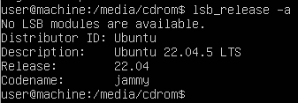

---


## 5.2. Настройка сети между виртуальными машинами

Для организации связи между машинами настроим внутреннюю сеть VirtualBox.

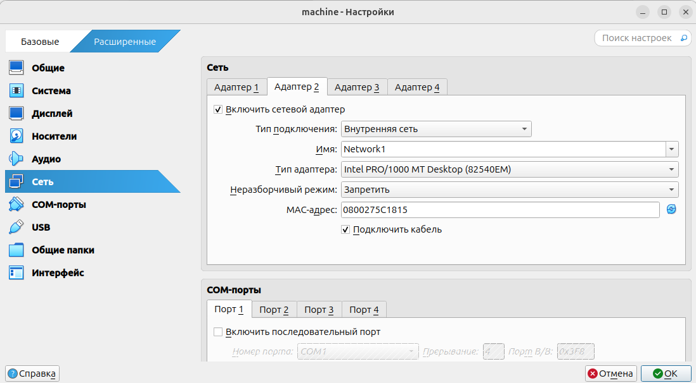

Конфигурация первой машины (CI/CD сервера):

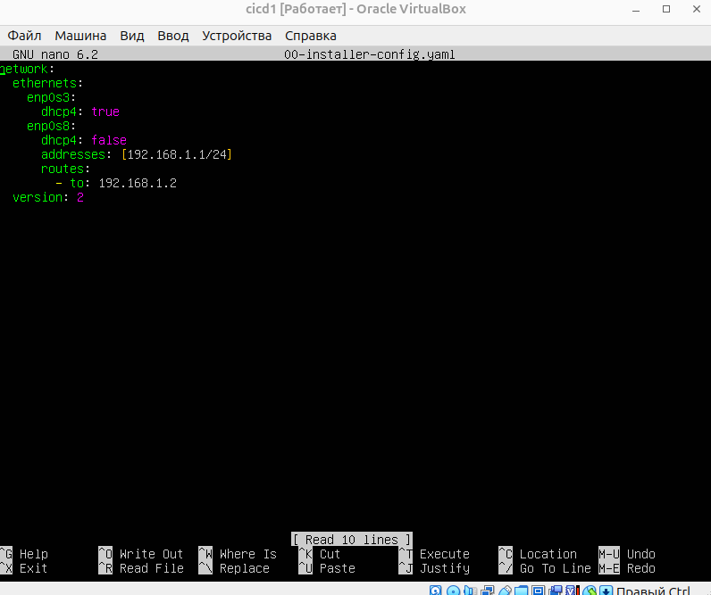

Конфигурация второй машины (target-сервера):

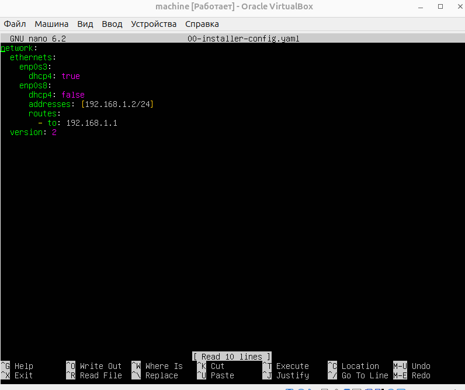

После изменения конфигурации применим настройки:

```bash
sudo netplan apply
```

Проверим доступность машин друг для друга:

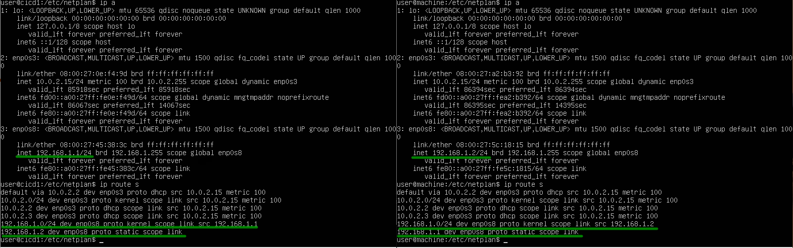

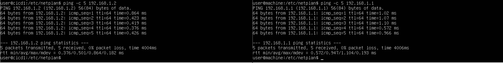

---

## 5.3. Настройка SSH-доступа

1. На обе машины установим SSH-сервер, запустим его и проверим состояние:

```bash
sudo apt install openssh-server
sudo systemctl start ssh
systemctl status ssh
```

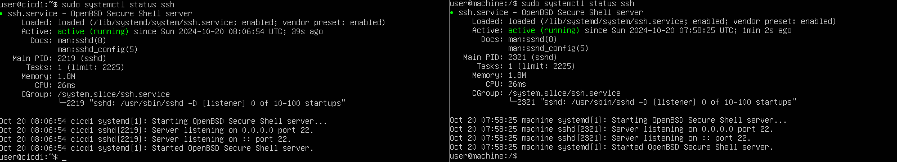

Установим автоматический запуск SSH-сервера при загрузке системы:

```bash
sudo systemctl enable ssh
```

2. На второй виртуальной машине изменим конфигурацию SSH-сервера в файле:

```text
/etc/ssh/sshd_config
```

Необходимо:

* включить использование порта `22`;
* разрешить вход под пользователем `root` (для лабораторной среды);
* включить аутентификацию по паролю.

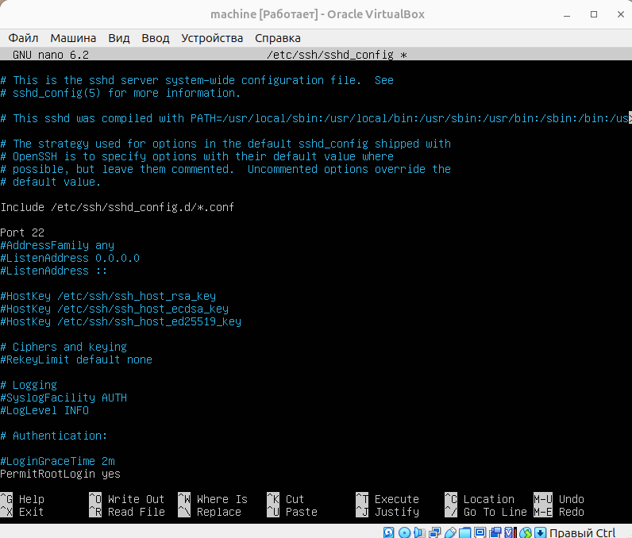
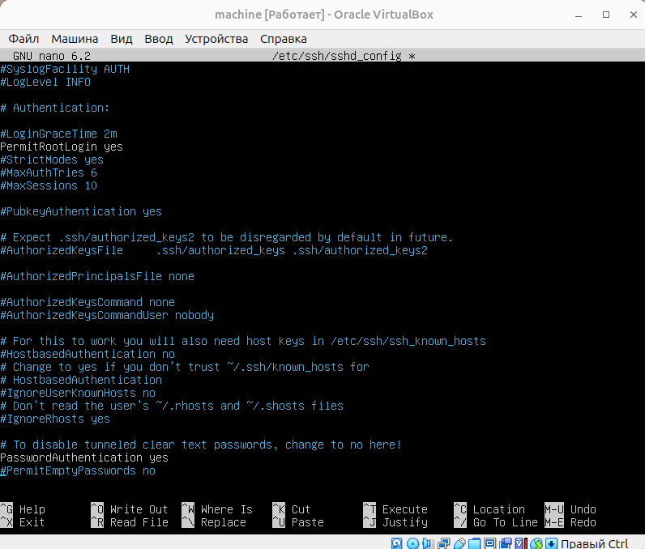

Перезапустим SSH:

```bash
sudo systemctl restart ssh
```

3. На первой машине выдадим пользователю `gitlab-runner` права на выполнение команд без пароля:

```bash
sudo visudo
```

Добавим строку:

```text
gitlab-runner ALL=(ALL) NOPASSWD: ALL
```

Переключимся на пользователя `gitlab runner`:

```bash
sudo su gitlab-runner
```

4. На первой машине сгенерируем пару SSH-ключей:

```bash
ssh-keygen
```

Публичный ключ добавим на вторую машину в файл:

```text
~/.ssh/authorized_keys
```

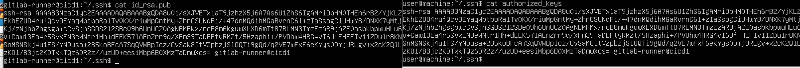

5. С первой машины проверим подключение:

```bash
ssh user@192.168.1.2
```

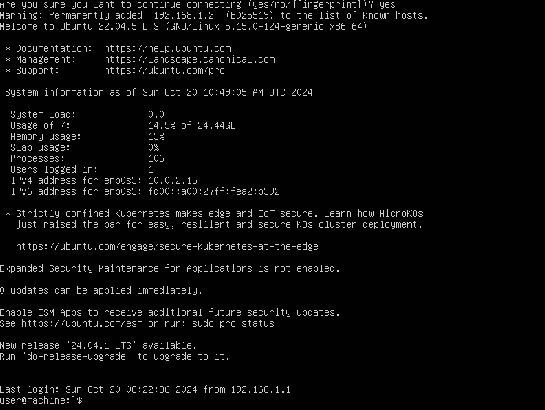

---

## 5.4. Настройка CD-этапа

Добавим в файл `.gitlab-ci.yml` этап `deploy`, который будет запускаться вручную после успешного завершения предыдущих стадий пайплайна.

Для выполнения вручную добавим в этап строку:

```yaml
when: manual
```

Файл `.gitlab-ci.yml`:

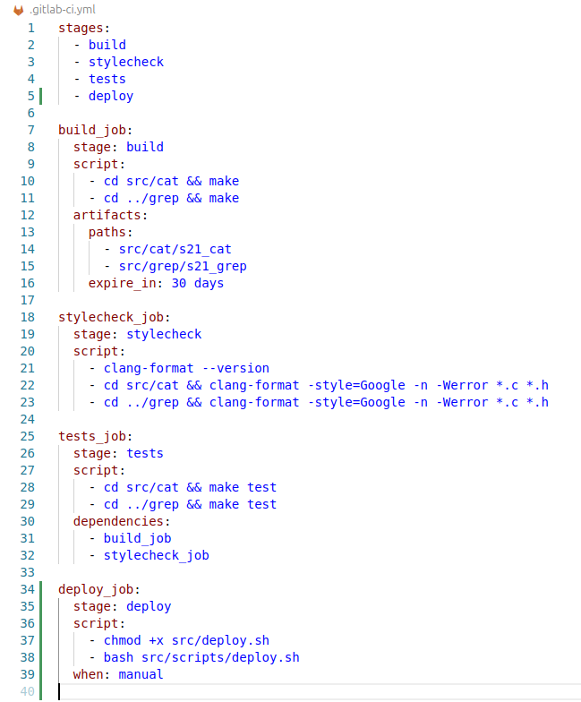

> Файл `.gitlab-ci.yml`, использованный в этой части: [/src/history/Part4/.gitlab-ci.yml](../../src/gitlab-ci.yml/history/Part5/.gitlab-ci.yml)

---

## 5.5. Скрипт деплоя

Напишем скрипт `deploy.sh`, выполняющий копирование артефактов на целевую машину через `ssh` и `scp`.

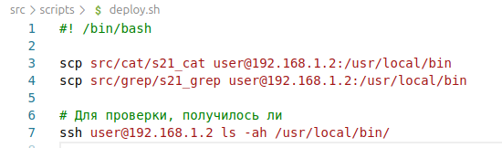

> Файл скрипта: [/src/scripts/deploy.sh](../../src/scripts/deploy.sh)

---

## 5.6. Выполнение деплоя

Запустим этап `deploy` и убедимся, что артефакты успешно скопированы на целевую машину.

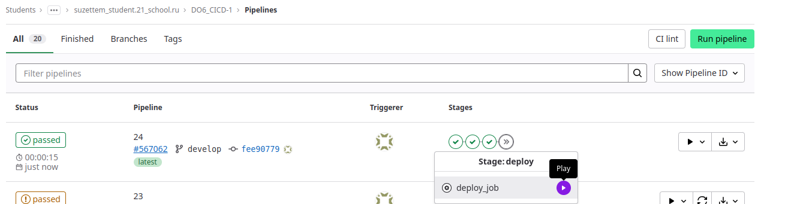
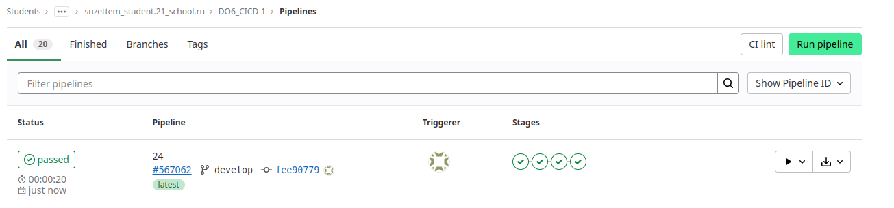
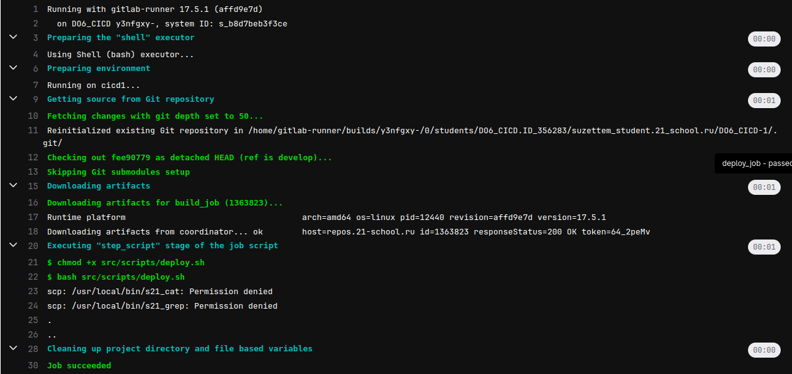

Чтобы разместить артефакты на второй машине, изменим права на `/usr/local/bin` для её пользователя `user`:

```bash
sudo chown user:user /usr/local/bin
```

После этого артефакты успешно размещаются на целевой машине в каталоге `/usr/local/bin`:

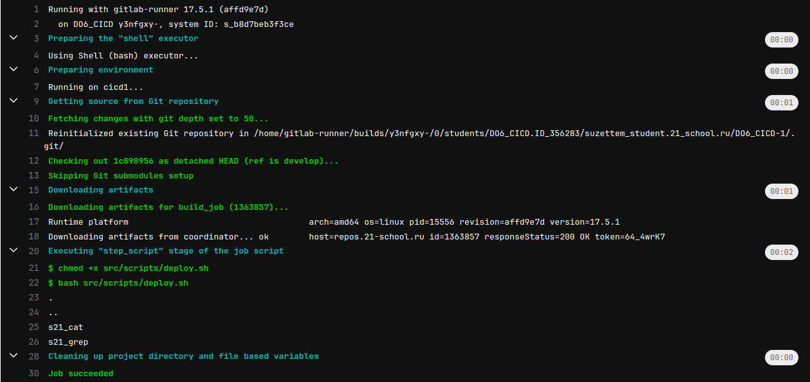
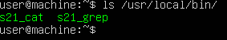

---

## Итог

Настроен этап деплоя, выполняющий перенос собранных артефактов на удалённую виртуальную машину по SSH.

---

## Навигация

↑ [README_ru](../../README_ru.md)

← [Part 4. Тесты](Part4_ru.md)

→ [Part 6. Уведомления в Telegram](Part6_ru.md)

---